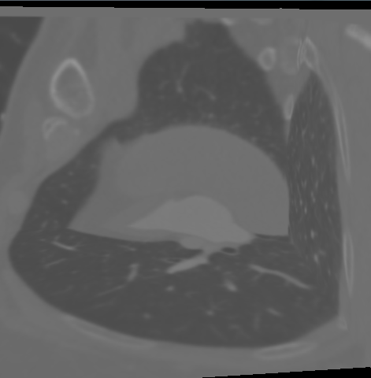
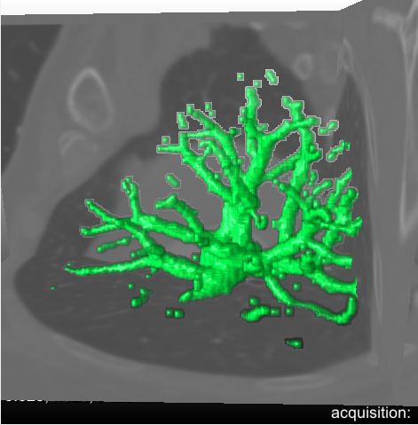
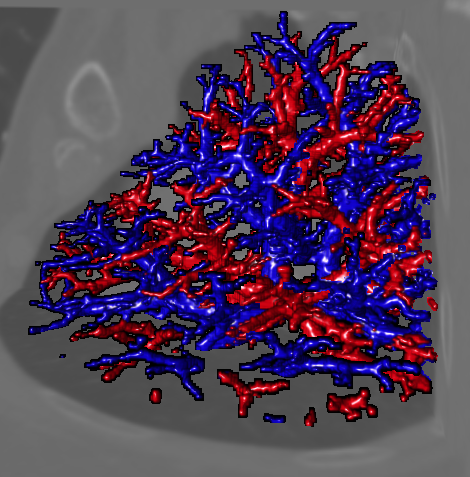

# Linking convolutional neural networks with graph convolutional networks: application in pulmonary artery-vein separation

This is source code of linking convolutional neural networks (CNN) with graph convolutional networks (GCN). It consists of the source code classifiers CNN3D, CNN-GCN and CNN-GCNt. Furthermore, a demo data extracted from a ROI (195*237*136) of right upper lung is provided. In the demo data, local patches were extracted perpendicularly to vessel orientation.

The Python with version 3.6.9 was used for this project. The required packages can be installed by:

```
pip install -r requirements.txt
```

<div align="center">
    
    
    
    <br>  
    <em align="center">Fig 1: A 3D visualization of pulmonary artery-vein separation.</em>  
</div>

If you use the software, you should reference the following paper:
```
@inproceedings{zhai2018pulmonary,
  title={Linking convolutional neural networks with graph convolutional networks: application in pulmonary artery-vein separation},  
  author={Zhai, Zhiwei and Staring, Marius and Zhou, Xuhui and Xie, Qiuxia and Xiao, xiaojuan and Bakker, M. Els and Kroft, Lucia J. and Lelieveldt, Boudewijn P.F. and Boon, Gudula J.A.M. and Klok, Frederikus A. and Stoel, Berend C},  
  booktitle={Graph Learning in Medical Imaging},
  pages={36--43},  
  year={2019},  
  publisher={Springer International Publishing},
}
```
